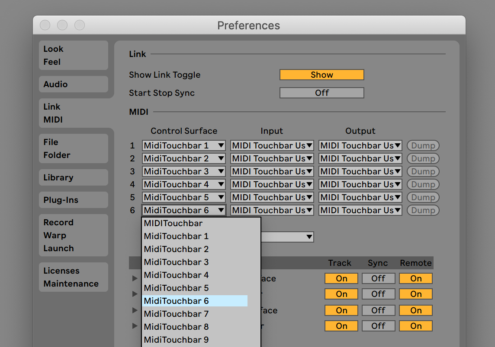

Summary
--

Lockable [blue hand functionality](https://help.ableton.com/hc/en-us/articles/206240184-Creating-your-own-Control-Surface-script) for nine sets of eight [Midi Touchbar](https://urbanlienert.com/miditouchbar/) faders


Installation
--

1. Download and move all `user_remote_scripts/MidiTouchbar_N` to:
```
Mac: HD:/Users/[Username]/Library/Preferences/Ableton/Live x.x.x/User Remote Scripts
Windows: C:\Users\[Username]\AppData\Roaming\Ableton\Live x.x.x\Preferences\User Remote Scripts
```

2. Ensure Ableton preferences for track and remote



3. Load `midi_touchbar_settings_magnesium.xml` puts magnesium faders on each channel (probably want to color them)


